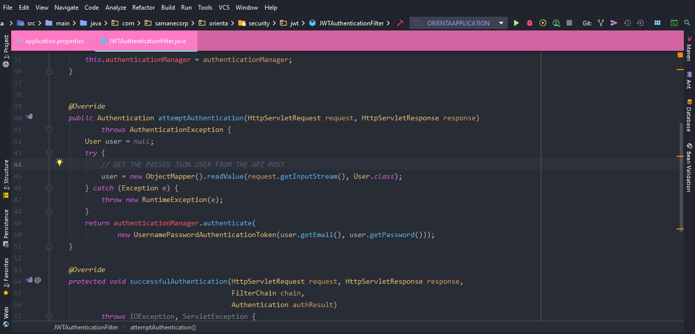

# Angular 11 JWT Authentication example
<pre>
/* === 🌌 WELCOME TO ORBIT CODE SPACESHIP 🌌  ===
*   
*	  Project :                   
*	  By :
*
*     ██████╗ ██████╗ ██████╗ ██╗████████╗    ████████╗██╗   ██╗██████╗ ███╗   ██╗███████╗██████╗ 
*    ██╔═══██╗██╔══██╗██╔══██╗██║╚══██╔══╝    ╚══██╔══╝██║   ██║██╔══██╗████╗  ██║██╔════╝██╔══██╗
*    ██║   ██║██████╔╝██████╔╝██║   ██║          ██║   ██║   ██║██████╔╝██╔██╗ ██║█████╗  ██████╔╝
*    ██║   ██║██╔══██╗██╔══██╗██║   ██║          ██║   ██║   ██║██╔══██╗██║╚██╗██║██╔══╝  ██╔══██╗
*    ╚██████╔╝██║  ██║██████╔╝██║   ██║          ██║   ╚██████╔╝██║  ██║██║ ╚████║███████╗██║  ██║
*     ╚═════╝ ╚═╝  ╚═╝╚═════╝ ╚═╝   ╚═╝          ╚═╝    ╚═════╝ ╚═╝  ╚═╝╚═╝  ╚═══╝╚══════╝╚═╝  ╚═╝
*          
*  AUTHOR : MOHAMED GUEYE [Orbit Turner] - Linkedin: www.linkedin.com/in/orbitturner - Email: orbitturner@orbitturner.com
*                              GITHUB : Orbit Turner    -   Website: http://orbitturner.com/ 
*
* ❤ 🔹 💚 ENJOY IT 💚 - 💚 SHARE IT 💚 - 💚 USE IT💚 🔹 ❤
*/
</pre>
🔻==========================================================🔻<br/>
>Project Name            :   ANGULAR-11-JWT-AUTHENTICATION-FRONT<br/>
>Project Description     :   A DemoProject for presenting my way of managing jwt auth in the front with 
                               angular using GUARDS / INTERCEPTORS / LOCALSTORAGE / ANGULAR-JWT2<br/>
>Project Developer       :   @OrbitTurner : https://orbitturner.com<br/>
>Project Main Language   :   TYPESCRIPT - ANGULAR 11<br/>
>Project Start Date      :   04/01/2021<br/>
>Project Type            :   Web Application / SAAS<br/>
>Project License         :   💚 GNU ✔ ITS FREE and OPEN just credit me.<br/>
>Project Inspired From   :   MOHAMED YOUSSFI - ANGULAR ACADEMY - BEZCODER<br/>
>Project Repository      :   https://github.com/orbitturner/ANGULAR-11-JWT-AUTH-FRONT-CLIENT<br/>

🔻==========================================================🔻

--------------------------------------------------------------------------
#IF YOU DOWNLOAD THE PROJECT IT CAN HAVING PROBLEM WORKING BECAUSE IT WAS MADE JUST TO DEMONSTRATE HOW TO SETUP THESE FOLLOWING :
<br/>🔻=====================🔻
-  AUTH.INTERCEPTOR.TS
-  AUTH.SERVICE.TS
-  LOGIN.COMPONENT.TS
-  API.CONFIG.TS
-  APP.MODULE.TS

> So you can use these files as they are in your project without any difficulty !

## PRE-REQUISITE
- ANGULAR-JWT2 ["angular2-jwt": "^0.2.3"]
- A BACKEND API APP ON SPRING BOOT WITH JWT CONFIGURED IN SPRING SECURITY

## Flow for User Registration and User Login
For JWT – Token based Authentication with Web API, we’re gonna call 2 endpoints:
- POST `api/auth/signup` for User Registration
- POST `api/auth/signin` for User Login

You can take a look at following flow to have an overview of Requests and Responses that Angular 11 Client will make or receive.


## Angular JWT App Diagram with Router and HttpInterceptor


## With Spring Boot back-end

> This project is the Front Client for a Spring Boot Backend. So it suppose you already have a fully finished Spring boot backend app with Rest Api and Spring Security Configured on JWT.

> The Backend Spring JWTAuthenticationFilter must be configured to receive JSON User to authenticate as the following:

--------------------------------------------------------------------------
Run `ng serve` for a dev server. Navigate to `http://localhost:4200/`.

## With Node.js Express back-end

> If You are on a Node.Js for your backend? You need some modification :

Open `app/_helpers/auth.interceptor.js`, modify the code to work with **x-access-token** like this:
```js
...

// const TOKEN_HEADER_KEY = 'Authorization'; // for Spring Boot back-end
const TOKEN_HEADER_KEY = 'x-access-token';   // for Node.js Express back-end

@Injectable()
export class AuthInterceptor implements HttpInterceptor {
  ...

  intercept(req: HttpRequest<any>, next: HttpHandler): Observable<HttpEvent<any>> {
    ...
    if (token != null) {
      // for Spring Boot back-end
      // authReq = req.clone({ headers: req.headers.set(TOKEN_HEADER_KEY, 'Bearer ' + token) });

      // for Node.js Express back-end
      authReq = req.clone({ headers: req.headers.set(TOKEN_HEADER_KEY, token) });
    }
    return next.handle(authReq);
  }
}

...
```

Run `ng serve --port 8081` for a dev server. Navigate to `http://localhost:8081/`.
